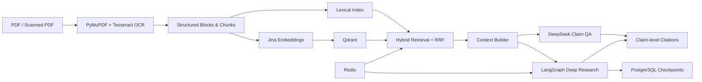

<div align="center">

# PaperResearch

**论文 RAG 与深度研究助手**<br>
Evidence-grounded Paper RAG & Deep Research

[](https://github.com/zhangjf314/Research/actions/workflows/ci.yml)
[](https://github.com/zhangjf314/Research/releases/tag/v1.0.0-portfolio)


[快速开始](#快速开始) ·
[系统架构](#系统架构) ·
[核心能力](#核心能力) ·
[验证结果](#验证结果) ·
[演示](#演示) ·
[已知限制](#评测与真实性边界)

</div>

PaperResearch 是一个面向科研论文的端到端 RAG 与 Deep Research 系统。它支持 PDF/OCR 解析、混合检索、结构化 Claim 引用、DeepSeek 问答、LangGraph 深度研究、Checkpoint 恢复、Token/费用追踪以及 Docker 化部署。

这个仓库是一个个人求职 Portfolio 项目：它强调真实工程闭环、可审计证据链和边界披露，而不是宣称商业生产级泛化能力。

## 为什么做这个项目

普通论文聊天工具通常能给出自然语言回答，却很难说清楚：

- 结论来自哪篇论文；
- 对应哪一页、哪一个文本块；
- 检索和生成过程是否可追踪；
- Agent 中断后能否恢复；
- 模型调用消耗了多少 Token 和费用；
- 扫描 PDF 是否能进入同一条检索链路。

PaperResearch 将论文解析、混合检索、Claim 级引用、Deep Research、Checkpoint、费用追踪和工程评测组合成一条可审计链路。

## 核心能力

| 能力 | 实现 |
| --- | --- |
| PDF 解析 | PyMuPDF，输出结构化页面、Block、Chunk 和解析 Manifest |
| OCR | Docker 内 Tesseract，支持文本、混合和扫描 PDF |
| Embedding | Jina `jina-embeddings-v5-text-small` |
| 向量数据库 | Qdrant，支持版本化 Collection 和 Snapshot Restore |
| 混合检索 | Dense + Lexical + Reciprocal Rank Fusion |
| 论文问答 | DeepSeek V4 Flash，结构化 Claim JSON |
| 引用校验 | Citation ID、Context、Block 和 Page 确定性校验 |
| Deep Research | LangGraph：规划、检索、证据评估、生成、引用校验 |
| Checkpoint | PostgreSQL 持久化，支持容器重启后恢复 |
| 缓存与控制 | Redis Cache、Rate Limit、Import Lock |
| 可观测性 | Request ID、Trace、Token、Cost、Latency、Failure Taxonomy |
| 部署 | FastAPI + Nginx + PostgreSQL + Qdrant + Redis + Docker Compose |

## 系统架构



详细设计见 [Architecture](docs/architecture.md)、[PDF RAG 数据流](docs/pdf-rag-data-flow.md) 和 [LangGraph 工作流](docs/langgraph-workflow.md)。

## 验证结果

| 验证项 | 结果 |
| --- | ---: |
| DeepSeek Full QA | 50 / 50 完成，0 工程失败 |
| Structured Output | 100% |
| Citation ID / Context / Page | 100% 确定性校验通过 |
| Full QA Token | 529,410 |
| Full QA 估算费用 | $0.0751 |
| Full QA P95 延迟 | 8.22 s |
| Deep Research | 端到端完成 |
| Docker OCR | Text / Mixed / Scanned 全部通过 |
| Stability Test | 30 分钟，568 请求，0 失败 |
| API 重启恢复 | 2.113 s |
| Automated Tests | 599 passed |

以上结果来自 50 条人工审核的内部开发评测数据和受控工程验收，不是独立 blind benchmark。完整证据见 [Portfolio Release Audit](docs/portfolio-release-audit-v1.md) 和 [Release Checklist](docs/release-checklist-v1.0.0-portfolio.md)。

## 演示

### 1. 论文入库

```text
上传 PDF → 页面解析/OCR → Chunk → Embedding → Qdrant
```

### 2. 证据化问答

问答结果保留结构化证据：Answer、Atomic Claims、Paper ID、Page、Block ID 和 Citation Key。示例见 [Demo Cases](docs/demo-cases.md) 与 [Full QA Summary](docs/deepseek-full-qa-final-summary-v1.md)。

### 3. Deep Research

```text
plan → retrieve → assess_evidence → synthesize → validate_citations → persist_trace
```

报告示例：[DeepSeek Production Deep Research](docs/end-to-end-deepseek-production-v2.md) 和 [Demo Research Report](artifacts/demo-research-report-deepseek-v1.md)。

## 快速开始

```powershell
git clone https://github.com/zhangjf314/Research.git
cd Research

Copy-Item .env.example .env
# 在 .env 中填写 DeepSeek 与 Jina 访问凭据

docker compose up -d --build
docker compose ps

Invoke-RestMethod http://localhost/api/v1/health
Invoke-RestMethod http://localhost/api/v1/capabilities
```

入口：

- UI: <http://localhost/api/v1/ui>
- OpenAPI: <http://localhost/docs>
- Health: <http://localhost/api/v1/health>
- Qdrant: <http://localhost:6333>
`.env` 不得提交 Git。默认 Compose 凭据仅用于本地开发。

## 使用示例

```powershell
$upload = curl.exe -sS `
  -F "file=@paper.pdf;type=application/pdf" `
  http://localhost/api/v1/papers/upload |
  ConvertFrom-Json

$paperId = $upload.paper.id

Invoke-RestMethod `
  -Method Post `
  "http://localhost/api/v1/papers/$paperId/index"

$qa = @{
  question = "What is the main method proposed by this paper?"
  paper_ids = @($paperId)
  top_k = 5
} | ConvertTo-Json

Invoke-RestMethod `
  -Method Post `
  http://localhost/api/v1/qa `
  -ContentType application/json `
  -Body $qa
```

更多命令见 [Quickstart](docs/quickstart.md) 和 [API Examples](docs/api-examples.md)。

## 技术栈

| Layer | Stack |
| --- | --- |
| API | FastAPI · Pydantic · Uvicorn · Nginx |
| LLM | DeepSeek V4 Flash · OpenAI-compatible API |
| Agent | LangGraph · PostgreSQL Checkpointer |
| Retrieval | Jina Embeddings · Qdrant · Lexical Index · RRF |
| Parsing | PyMuPDF · Tesseract OCR |
| Storage | PostgreSQL · Redis · Qdrant |
| Ops | Docker Compose · GitHub Actions |
| Testing | Pytest · Ruff |

## 项目结构

| Path | 用途 |
| --- | --- |
| `src/paper_research/` | API、LangGraph Agent、Claim QA、Retrieval、Provider 与评测基础设施 |
| `scripts/` | Evaluation、restore、OCR 和 release 工具 |
| `tests/` | Unit、integration 和 release tests |
| `docs/` | Architecture、audits 和 guides |
| `data/evaluation/` | Public-safe evaluation summaries |
| `deploy/` | Deployment configuration |

## 评测与真实性边界

- `gold-dev-v1` 的 50 条数据属于人工审核的内部开发评测集，不是独立 blind benchmark。
- Citation ID、Context、Block 和 Page 使用确定性校验。
- Claim 与引用之间的完整语义蕴含未经过大规模人工审计。
- `SEMANTIC_CLAIM_SUPPORT_AUDIT=NOT_FORMALLY_VALIDATED`。
- `STRONG_GROUNDING_CLAIM_ALLOWED=false`，`STRONG_GENERALIZATION_CLAIM_ALLOWED=false`。
- `RETRIEVAL_GENERALIZATION_EVIDENCE=DIAGNOSTIC_ONLY`，`retrieval-diagnostic-v1` 仅用于诊断回归。
- 30 分钟测试只能说明该测试窗口内未观察到明显的持续异常增长。
- 本项目不宣称商业生产级长期稳定性。

允许的准确表述是：项目完成了真实模型、真实数据库、真实向量库和真实 Docker 运行验证。更多边界见 [Known Limitations](docs/known-limitations.md) 与 [Portfolio Evaluation Policy](docs/portfolio-evaluation-policy-v1.md)。

## 文档导航

- 架构：[Architecture](docs/architecture.md)、[PDF RAG 数据流](docs/pdf-rag-data-flow.md)、[LangGraph 工作流](docs/langgraph-workflow.md)
- 部署：[部署手册](docs/deployment-runbook.md)、[Docker OCR](docs/docker-ocr-production-audit-v2.md)、[Checkpoint 恢复](docs/langgraph-production-recovery-audit-v2.md)、[Backup / Restore](docs/backup-restore-audit.md)
- 评测：[评测策略](docs/portfolio-evaluation-policy-v1.md)、[Full QA](docs/deepseek-full-qa-final-summary-v1.md)、[Deep Research](docs/end-to-end-deepseek-production-v2.md)
- 发布与安全：[Security Audit](docs/git-history-secret-review-v1.md)、[Known Limitations](docs/known-limitations.md)
- 求职材料：[Resume Description](docs/resume-description.md)、[Interview Guide](docs/interview-guide.md)

## 开发与测试

```powershell
.\.venv\Scripts\python.exe -m pytest -q
.\.venv\Scripts\python.exe -m ruff check .
.\.venv\Scripts\python.exe -m compileall -q src scripts tests
powershell -ExecutionPolicy Bypass -File scripts\run_release_tests.ps1
```

## Release

- Current release: [`v1.0.0-portfolio`](https://github.com/zhangjf314/Research/releases/tag/v1.0.0-portfolio)
- Package version: `1.0.0+portfolio`
- Release evidence: [Release Checklist](docs/release-checklist-v1.0.0-portfolio.md)
