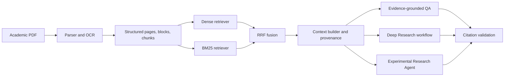

# PaperResearch

PaperResearch is an evidence-grounded system for academic-paper ingestion, hybrid retrieval, citation-aware question answering, Deep Research workflows, and an experimental Research Agent runtime. The repository emphasizes reproducible evaluation, canonical provenance, explicit promotion gates, and recorded negative results rather than unsupported production claims.

## Project position

The current production baseline is **P0**: dense retrieval plus BM25, reciprocal-rank fusion (RRF), and rank-order context packing. RAG Quality v3 is closed:

- RAG_QUALITY_V3_CLOSED
- POST_RETRIEVAL_OPTIMIZATION_CLOSED
- NO_CANDIDATE_PROMOTED
- PRODUCTION_P0_RETAINED
- FULL_QA_NOT_ELIGIBLE

No evaluated reranker or selector has been deployed as the production default.

## Core capabilities

| Area | Capability |
| --- | --- |
| Paper ingestion | PDF parsing, OCR fallback, structured pages, blocks, chunks, and content hashing |
| Retrieval | Configured dense embeddings, BM25, Qdrant, and deterministic RRF fusion |
| Provenance | Canonical document and source-block identity preserved from ingestion through evaluation |
| Evidence QA | Structured claim output and deterministic citation validation |
| Research workflows | Fixed Deep Research orchestration plus an explicitly experimental agent runtime |
| Evaluation | Gold-free runtime/evaluation separation, sealed snapshots, paired comparisons, loss decomposition, and promotion gates |

## Local runtime validation

The latest local Docker acceptance run validated the following user-facing paths
against an indexed paper:

- Paper Library upload, indexing, selection, and Direct QA;
- citation and evidence rendering for Direct QA;
- Deep Research workflow completion with retrieval and a non-empty report; and
- Research Agent completion with real model-driven tool calls, evidence, verifier
  execution, and a non-empty report.

The validated runtime uses SiliconFlow `Qwen/Qwen3-Embedding-0.6B` embeddings
and DeepSeek Chat Completions. DeepSeek structured results and Agent decisions
use forced ordinary function calls with strict local validation; this is a
provider compatibility boundary, not a change to retrieval or production RAG
semantics. See [local runtime acceptance](docs/LOCAL_RUNTIME_ACCEPTANCE.md).

This validation does not promote a reranker or listwise selector. The RAGQ3
conclusion remains **NO_CANDIDATE_PROMOTED** and **PRODUCTION_P0_RETAINED**.

## System architecture


```mermaid
flowchart LR
    P[Academic PDF] --> I[Parser and OCR]
    I --> S[Structured pages, blocks, chunks]
    S --> D[Dense retriever]
    S --> B[BM25 retriever]
    D --> R[RRF fusion]
    B --> R
    R --> C[Context builder and provenance]
    C --> Q[Evidence-grounded QA]
    C --> W[Deep Research workflow]
    C --> A[Experimental Research Agent]
    Q --> V[Citation validation]
    W --> V
    A --> V
```

## Retrieval pipeline

1. A parsed paper is represented as canonical documents, source blocks, and chunks.
2. Dense retrieval and BM25 each produce an ordered candidate list.
3. RRF combines both lists with deterministic tie handling.
4. The context builder preserves candidate rank and provenance while packing the requested top-k context.
5. QA and evaluation consume the resulting evidence; evaluation attribution is kept separate from runtime retrieval.

The production P0 contract uses Dense + BM25 + RRF. Reranking is disabled in the production default.

## Gold-free evaluation architecture

RAGQ3 introduced a Gold-free execution boundary: runtime/index payloads do not contain Gold labels, while a separate evaluation resolver applies Gold attribution only after a candidate snapshot has been produced. This supports canonical document and source-block provenance, isolated Gold-free index builds, snapshot-first paired evaluation with identical candidate membership, evaluation-only oracle ceilings, and candidate-generation, ranking, and packing-loss decomposition.

Historical A1D/A2B quality evidence remains preserved, but it is **INVALIDATED_BY_GOLD_DEPENDENCY** and is not used as current promotion evidence.

## RAG quality methodology

The quality program uses frozen candidate definitions, metric contracts, and promotion gates before outcomes are read. It distinguishes:

- **VALIDATED**: execution or measurement evidence that passed its stated boundary;
- **REJECTED**: a candidate or intervention that failed a frozen promotion/generality gate;
- **INVALIDATED**: historical evidence excluded because its attribution boundary was unsound;
- **NOT_RUN**: deliberately prohibited downstream work, including Full QA and further selector search.

Development-visible evidence is not described as blind after it has been consumed. A fresh blind result is required before any Full QA or production promotion path.

## RAGQ3 final results

### Clean development reranking

| Metric | C1 clean baseline | C2 Qwen3 reranker |
| --- | ---: | ---: |
| GoldR@5 | .603084 | .723634 |
| Claim@5 | .763158 | .907895 |
| Ranking loss | 19 | 7 |

C2 passed its clean **development** gate only.

### Fresh blind result

| Metric | B1 R0 | B1 R1 |
| --- | ---: | ---: |
| GoldR@5 | .691667 | .783333 |
| MRR | .536667 | .605000 |
| NDCG@10 | .609226 | .685355 |

Despite these average changes, the frozen B1 blind gate failed. It is not a blind-validation pass and does not make Full QA eligible.

### Listwise evidence-set selection

| Combined development-visible metric | D2B R0 | D2B R1 |
| --- | ---: | ---: |
| GoldR@5 | .738812 | .849738 |
| Claim@5 | .852941 | .955882 |
| MultiComplete@5 | .562500 | .875000 |
| Ranking loss | 24 | 4 |

D2B was a valid 236-question listwise evaluation and recovered 8/8 pointwise, 4/5 cross-section, and 4/4 set-completeness residual cases. Promotion was nevertheless rejected: DEV evidence had 9 new GoldR tail regressions against a frozen maximum of 2.

The final decision is therefore **no candidate promoted** and **production P0 retained**. The static hybrid/heuristic selector was rejected; the earlier D2 selector quality is **NOT_EVALUATED** because all output was truncated and fail-closed to baseline.

## Limitations

- RAGQ3 does not establish production quality improvement.
- Clean development gains do not replace fresh blind generalization evidence.
- Full QA was not run and is not eligible under the final gate.
- The repository retains historical invalidated artifacts for audit; they are not current quality evidence.
- Further D3/D4 selector, prompt, threshold, or candidate searches are outside the closed RAGQ3 program.

## Reproducibility

The repository keeps public-safe frozen manifests, final decisions, tests, and scripts necessary to inspect the methodology. Large raw runtime artifacts, caches, provider raw payloads, credentials, and local operational files are not part of the sanitized public release.

Read the RAGQ3 conclusions in:

- [Final report](docs/RAG_QUALITY_V3_FINAL_REPORT.md)
- [Evidence ledger](docs/rag-quality-v3-evidence-ledger.md)
- [Portfolio evidence summary](docs/RAG_QUALITY_V3_PORTFOLIO_SUMMARY.md)

## Quick start

```powershell
git clone https://github.com/zhangjf314/Research.git
cd Research
Copy-Item .env.example .env
# Configure only the providers needed for your local environment.
docker compose up -d --build
Invoke-RestMethod http://localhost/api/v1/health
```

Useful local endpoints:

- UI: <http://localhost/api/v1/ui>
- OpenAPI: <http://localhost/docs>
- Capabilities: <http://localhost/api/v1/capabilities>

Never commit .env or provider credentials.

## Repository structure

| Path | Purpose |
| --- | --- |
| src/paper_research/ | API, ingestion, retrieval, QA, workflows, providers, and evaluation infrastructure |
| scripts/ | Reproducibility, validation, and evaluation utilities |
| tests/ | Unit, integration, and evaluation-boundary tests |
| docs/ | Architecture, operations, releases, and public evidence documents |
| artifacts/rag-quality-v3/ | Preserved RAGQ3 manifests and final decisions; the public snapshot retains only necessary small evidence artifacts |
| deploy/ | Deployment configuration |

## Development checks

```powershell
.\.venv\Scripts\python.exe -m pytest -q tests/test_gold_free_runtime.py tests/test_ragq3_attribution.py tests/test_ragq3_execution_semantics.py tests/test_ragq3_identity.py tests/test_ragq3_lineage.py tests/test_ragq3_production_isolation.py
.\.venv\Scripts\python.exe -m compileall -q src scripts
```

The public snapshot intentionally excludes raw provider traces, local indexes, and historical Git-object-only freeze checks. The final reports and compact manifests preserve the conclusions without publishing those private runtime artifacts.
