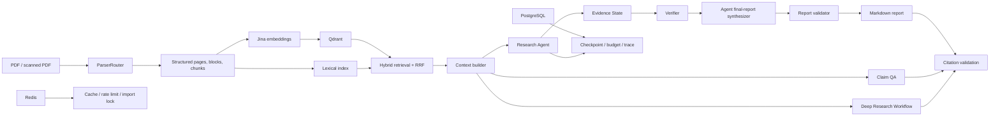

# PaperResearch

Evidence-grounded Paper RAG, Deep Research Workflow, and Research Agent runtime for academic papers.

[](https://github.com/zhangjf314/Research/actions/workflows/ci.yml)
[](https://github.com/zhangjf314/Research/releases/tag/v1.2.0-portfolio)


PaperResearch is an end-to-end system for academic PDF ingestion, hybrid retrieval, evidence-grounded QA, Deep Research workflows, and a state/observation-driven Research Agent. It emphasizes real engineering closure, auditable evidence chains, failure materialization, reproducible benchmark artifacts, and explicit limitations rather than broad production or generalization claims.

## Core capabilities

| Area | Implementation |
| --- | --- |
| PDF ingestion | PyMuPDF parsing, structured pages/blocks/chunks, file hashing, Docker OCR roundtrips |
| OCR | Tesseract fallback for text, mixed, and scanned PDFs |
| Retrieval | Jina embeddings, Qdrant, lexical index, Current Hybrid + RRF |
| QA | DeepSeek V4 Flash, structured claim JSON, deterministic citation validation |
| Deep Research Workflow | Fixed orchestration: plan, retrieve, assess, synthesize, validate, persist |
| Research Agent | Planner, dynamic tool/action selection, Evidence State, verifier, bounded replan mechanism, post-loop final-report synthesis |
| Reliability | PostgreSQL checkpoint/resume, request ledger, usage/cost accounting, stop policies |
| Observability | Trace, request IDs, failure taxonomy, Docker/runtime capability checks |
| Benchmarking | Frozen RAG backend, Workflow vs Agent paired harness, blind score freeze, validity audit |

Reranker, query rewrite, query decomposition, and context-selector variants were evaluated under frozen development ablations and rejected for the final RAG backend used in the benchmark.

## System architecture


```mermaid
flowchart LR
    A["PDF / scanned PDF"] --> B["ParserRouter"]
    B --> C["Structured pages, blocks, chunks"]
    C --> D["Jina embeddings"]
    C --> E["Lexical index"]
    D --> F["Qdrant"]
    E --> G["Hybrid retrieval + RRF"]
    F --> G
    G --> H["Context builder"]
    H --> I["Claim QA"]
    H --> J["Deep Research Workflow"]
    H --> K["Research Agent"]
    K --> L["Evidence State"]
    L --> M["Verifier"]
    K --> N["Checkpoint / budget / trace"]
    M --> R["Agent final-report synthesizer"]
    R --> S["Report validator"]
    S --> T["Markdown report"]
    J --> O["Citation validation"]
    I --> O
    T --> O
    P["PostgreSQL"] --> N
    Q["Redis"] --> U["Cache / rate limit / import lock"]
```

The UI exposes Workflow and Agent as explicit research modes. `workflow` is preselected when no `mode` query parameter is provided. The Agent remains a parallel experimental runtime, not the default execution path.

Agent final-report synthesis is a presentation stage after the Agent control loop has finished and verification has passed. It uses only the verified Evidence State; it is not an Agent tool, planner step, retriever, or replan behavior.

The UI exposes two research execution modes:

- Deep Research Workflow — predefined orchestration.
- Research Agent — state/observation-driven dynamic tool execution.

Both reuse the frozen RAG backend.

## Workflow vs Research Agent


```mermaid
flowchart TB
    subgraph Workflow["Frozen Workflow"]
        W1["Fixed research orchestration"] --> W2["Retrieval"]
        W2 --> W3["Synthesis"]
        W3 --> W4["Verification contract"]
    end

    subgraph Agent["Research Agent"]
        A1["Planner"] --> A2["Decision / Tool Selection"]
        A2 --> A3["Tool Execution"]
        A3 --> A4["Observation"]
        A4 --> A5["Evidence State"]
        A5 --> A6["Verifier"]
        A6 --> A7["Finish or bounded Replan decision"]
        A7 --> A8["Agent control loop ends"]
        A8 --> A9["Final Report Synthesizer"]
        A9 --> A10["Report Validator"]
        A10 --> A11["Markdown Report"]
    end

    C["Checkpoint / Budget / Trace"] --> Workflow
    C --> Agent
```

The Agent implements a bounded replanning mechanism, but no effective replan was naturally exercised in the final 60-task benchmark:

```text
LIVE_EFFECTIVE_REPLAN_NOT_OBSERVED
effective_replan_count = 0
```

Stage 4 benchmark artifacts and conclusions correspond to the frozen v1.1.0 Agent runtime before final-report synthesis was added. The final-report layer is a later runtime capability and does not reinterpret those benchmark results.

The observed dynamic behavior came from state/observation-driven tool and action selection.

## Final benchmark summary

The final Workflow vs Agent result uses only `stage4-official-v1-attempt4`.

| Metric | Workflow | Agent |
| --- | ---: | ---: |
| Tasks | 60 | 60 |
| COMPLETED | 0 | 56 |
| FAILED | 60 | 4 |
| Provider requests | 73 | 414 |
| Tokens | 159,769 | 414,569 |
| Cost | $0.03093 | $0.06448 |
| P50 latency | 10.43s | 15.99s |
| P95 latency | 26.84s | 21.45s |
| Dynamic tool selection | N/A | 56/60 |
| Effective Replan | N/A | 0/60 |

Workflow requests executed successfully at the runtime/provider level, but all 60 failed the frozen final schema or verification contract:

```text
SYSTEM_SCHEMA_FAILURE = 10
SYSTEM_VERIFICATION_FAILURE = 50
Workflow HTTP/runtime succeeded = 60/60
Workflow units with provider calls = 60/60
Workflow units with generated report body = 50/60
```

Agent failures were valid system failures, not benchmark infrastructure failures:

```text
SYSTEM_PROVIDER_FAILURE = 4
```

### Structured proxy metrics

Stage 4C.1 confirmed that the following are structural proxies, not direct semantic scoring of all rubric items:

| Metric | Workflow | Agent | Interpretation |
| --- | ---: | ---: | --- |
| Structured required-dimension coverage proxy | 0.000 | 0.933 | Derived from COMPLETED + verification PASS + structural/runtime conditions |
| Structured required-claim coverage proxy | 0.000 | 0.933 | Not a per-claim semantic judgment over all 180 required claims |
| Structured evidence coverage proxy | 0.000 | 0.933 | Not a per-evidence semantic match over all evidence items |

```text
dimensions individually semantically scored = 0
claims individually semantically scored = 0
evidence items individually semantically scored = 0
```

Citation validity and unsupported-claim rate are retained for audit but are not used as headline quality claims because both systems emitted zero citations in the final Stage 4 package:

```text
citation_count = 0
evaluated_core_claim_count = 0
VACUOUS_VALIDITY_CONVENTION_FOR_EMPTY_CITATION_SETS
```

## Evaluation evidence levels

- `gold-dev-v1`: 50 human-reviewed internal development records used for QA,
  retrieval, and regression evaluation. It is not a blind holdout.
- `retrieval-diagnostic-v1`: 27 claim-level diagnostic records used for
  retrieval/citation failure analysis and regression checks. It has been used
  during development and must not be described as blind.
- `shadow-holdout-pilot-v1`: optional future 10-15 sample pilot. It is not part
  of the current release evidence.
- `STRONG_GENERALIZATION_CLAIM_ALLOWED=false`.

## Final benchmark interpretation

In the frozen 60-task / 120-run paired benchmark, the Research Agent substantially improved structured task completion and runtime reliability: 56/60 Agent tasks reached `COMPLETED`, while the frozen Workflow's 60/60 tasks reached terminal states but did not pass the final schema or verification contract.

The Agent also used substantially more provider calls, tokens, and cost.

Stage 4 claim/dimension/evidence coverage is a structured proxy, not a direct semantic score over all Gold rubric items. The frozen blind package also lacked comparable final answer text for both systems, so semantic LLM judging was not run:

```text
semantic_judge_complete = false
judge_gap = JUDGE_MISSING_OUTPUT_TEXT_FOR_FAIR_BLIND_INPUT
```

The benchmark supports an Agent advantage in runtime control, dynamic tool selection, and structured completion reliability. It does not support claims such as “Agent semantic research quality improved by 93.3 percentage points.”

## Benchmark limitations

1. The benchmark is internally authored and reviewed.
2. `budget_comparable=false`; this is not a strict equal-budget causal ablation.
3. Claim/dimension/evidence metrics are structural proxies.
4. No semantic blind LLM judge was run.
5. Effective live replan was not observed in the final benchmark.
6. `STRONG_GENERALIZATION_CLAIM_ALLOWED=false`.
7. Benchmark harness hardening required three invalidated attempts before the final clean Attempt4; only Attempt4 contributes official results.

Detailed evidence:

- [Stage 4 final benchmark](docs/research-agent/benchmark/stage4-final-benchmark-v1.md)
- [Stage 4 validity audit](docs/research-agent/benchmark/stage4c-final-validity-audit-v1.md)
- [Metric provenance](docs/research-agent/benchmark/stage4c-metric-provenance-v1.md)
- [Portfolio claim boundary](docs/research-agent/benchmark/stage4-portfolio-claim-boundary-v1.md)
- [Release readiness](docs/research-agent/benchmark/stage4-portfolio-release-readiness-v1.md)

## Quick start

```powershell
git clone https://github.com/zhangjf314/Research.git
cd Research

Copy-Item .env.example .env
# Fill provider credentials in .env.

docker compose up -d --build
docker compose ps

Invoke-RestMethod http://localhost/api/v1/health
Invoke-RestMethod http://localhost/api/v1/capabilities
```

Entrypoints:

- UI: <http://localhost/api/v1/ui>
- OpenAPI: <http://localhost/docs>
- Health: <http://localhost/api/v1/health>
- Capabilities: <http://localhost/api/v1/capabilities>
- Qdrant: <http://localhost:6333>

UI page GETs do not consume business API rate buckets. `.env` must not be committed.

## Usage example

```powershell
$upload = curl.exe -sS `
  -F "file=@paper.pdf;type=application/pdf" `
  http://localhost/api/v1/papers/upload |
  ConvertFrom-Json

$paperId = $upload.paper.id

Invoke-RestMethod `
  -Method Post `
  "http://localhost/api/v1/papers/$paperId/index"

$qa = @{
  question = "What is the main method proposed by this paper?"
  paper_ids = @($paperId)
  top_k = 5
} | ConvertTo-Json

Invoke-RestMethod `
  -Method Post `
  http://localhost/api/v1/qa `
  -ContentType application/json `
  -Body $qa
```

More commands: [Quickstart](docs/quickstart.md), [API Examples](docs/api-examples.md).

## Technology stack

| Layer | Stack |
| --- | --- |
| API | FastAPI, Pydantic, Uvicorn, Nginx |
| LLM | DeepSeek V4 Flash, OpenAI-compatible API |
| Agent runtime | LangGraph, PostgreSQL Checkpointer |
| Retrieval | Jina Embeddings, Qdrant, Lexical Index, RRF |
| Parsing | PyMuPDF, Tesseract OCR |
| Storage | PostgreSQL, Redis, Qdrant |
| Ops | Docker Compose, GitHub Actions |
| Testing | Pytest, Ruff |

## Repository structure

| Path | Purpose |
| --- | --- |
| `src/paper_research/` | API, Workflow, Agent, QA, retrieval, providers |
| `scripts/` | Evaluation, validation, release, and audit tools |
| `tests/` | Unit, integration, release, and benchmark tests |
| `docs/` | Architecture, benchmark, release, and operations docs |
| `data/evaluation/` | Public-safe evaluation summaries and frozen benchmark artifacts |
| `deploy/` | Deployment configuration |

## Documentation

- Architecture: [Architecture](docs/architecture.md), [PDF RAG data flow](docs/pdf-rag-data-flow.md), [LangGraph workflow](docs/langgraph-workflow.md), [Research Agent runtime](docs/research-agent/research-agent-runtime.md)
- Operations: [Deployment runbook](docs/deployment-runbook.md), [Docker OCR audit](docs/docker-ocr-production-audit-v2.md), [Checkpoint recovery](docs/langgraph-production-recovery-audit-v2.md), [Backup / Restore](docs/backup-restore-audit.md)
- Evaluation: [Portfolio evaluation policy](docs/portfolio-evaluation-policy-v1.md), [Full QA](docs/deepseek-full-qa-final-summary-v1.md), [Deep Research](docs/end-to-end-deepseek-production-v2.md)
- Research Agent benchmark: [Final benchmark](docs/research-agent/benchmark/stage4-final-benchmark-v1.md), [Validity audit](docs/research-agent/benchmark/stage4c-final-validity-audit-v1.md)
- Portfolio materials: [Project summary](docs/portfolio/project-summary-v2.md), [Interview notes](docs/portfolio/interview-notes-v2.md), [Release status](docs/portfolio/release-status-v2.md)
- Security and limits: [Security audit](docs/git-history-secret-review-v1.md), [Known limitations](docs/known-limitations.md)
- v1.2.0 release: [Release notes](docs/releases/v1.2.0-portfolio.md), [Truth audit](docs/public-documentation-truth-audit-v1.md), [Change inventory](docs/releases/v1.2.0-change-inventory.md), [Version truth table](docs/releases/v1.2.0-version-truth-table.md), [Readiness](docs/releases/v1.2.0-portfolio-readiness.md)

## Development and tests

```powershell
.\.venv\Scripts\python.exe -m pytest -q
.\.venv\Scripts\python.exe -m ruff check .
.\.venv\Scripts\python.exe -m compileall -q src scripts tests
powershell -ExecutionPolicy Bypass -File scripts\run_release_tests.ps1
```

## Release status

- Current recommended release: [`v1.2.0-portfolio`](https://github.com/zhangjf314/Research/releases/tag/v1.2.0-portfolio)
- Package/runtime version: `1.2.0+portfolio`
- Project status: Portfolio Release / Feature Complete, released with documented limitations.
- `FEATURE_DEVELOPMENT_STOPPED=true`
- Previous tags retained: [`v1.0.0-portfolio`](https://github.com/zhangjf314/Research/releases/tag/v1.0.0-portfolio), [`v1.0.1-portfolio`](https://github.com/zhangjf314/Research/releases/tag/v1.0.1-portfolio)
