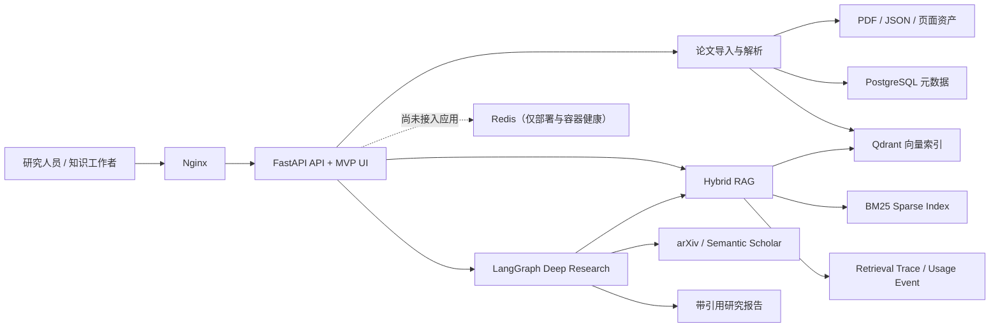

# 系统架构

## 设计原则

- 解析质量、引用可靠性和检索效果优先于界面包装。
- 所有分析字段和研究结论绑定论文、章节、页码和原文证据。
- Dense、Sparse、Fusion、Rerank 和最终上下文均可追踪。
- 外部搜索、自动导入和 Agent 循环受预算与停止条件约束。
- Provider 接口隔离本地基线与生产模型，便于替换 BGE-M3、Cross-Encoder 和 LLM。
