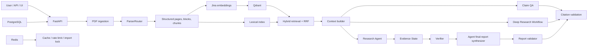

# PaperResearch Architecture

This document describes the current source/runtime architecture on `main` after
the v1.1.0 portfolio release. It separates live runtime facts from historical
benchmark artifacts.

## Runtime paths

```mermaid
flowchart LR
    U["User / API / UI"] --> A["FastAPI"]
    A --> P["PDF ingestion"]
    P --> R["ParserRouter"]
    R --> B["Structured pages, blocks, chunks"]
    B --> V["Jina embeddings"]
    B --> L["Lexical index"]
    V --> Q["Qdrant"]
    Q --> H["Hybrid retrieval + RRF"]
    L --> H
    H --> C["Context builder"]
    C --> QA["Claim QA"]
    C --> W["Deep Research Workflow"]
    C --> AG["Research Agent"]
    AG --> ES["Evidence State"]
    ES --> VF["Verifier"]
    VF --> FR["Agent final-report synthesizer"]
    FR --> RV["Report validator"]
    QA --> CV["Citation validation"]
    W --> CV
    RV --> CV
    DB["PostgreSQL"] --> A
    RD["Redis"] --> RC["Cache / rate limit / import lock"]
```

## Major components

| Component | Current implementation | Boundary |
| --- | --- | --- |
| API | FastAPI routes under `src/paper_research/api` | UI/API surface only; provider keys are not emitted. |
| Ingestion | Upload service, file hash handling, parser routing, structured artifacts | Does not create benchmark labels. |
| ParserRouter | `PARSER_BACKEND=grobid`, `docling`, `ocr`, `pymupdf`, or `auto` | `auto` tries Docling when installed and supported, otherwise PyMuPDF; low-text PDFs can route to OCR. |
| Retrieval | Frozen Current Hybrid backend over Qdrant dense vectors and lexical sparse index | Stage 3/4 Agent comparisons reuse the Stage 2 lock. |
| Reranker | Supported as an evaluated capability but disabled in the frozen backend | Not part of the final Stage 4 paired benchmark backend. |
| Query rewrite/decomposition | Evaluated earlier, rejected for the final frozen backend | Disabled by the Stage 3 lock. |
| Claim QA | Structured claim JSON with deterministic citation validation | Full QA evidence belongs to earlier production QA artifacts. |
| Deep Research Workflow | LangGraph fixed orchestration path at `/api/v1/research/deep` | Frozen control group for Workflow-vs-Agent comparisons. |
| Research Agent | State/observation-driven runtime at `/api/v1/research/agent` | Parallel experimental mode; not default while benchmark boundaries are preserved. |
| Agent final report | Post-loop synthesis from verified Evidence State | Presentation layer; not an Agent tool, retriever, planner, or Stage 4 replan behavior. |
| PostgreSQL | Application persistence and checkpoint-related storage where configured | Used by runtime services and recovery checks. |
| Redis | Best-effort cache, API rate limiter, paper import lock, health/capability telemetry | Not a vector store or retrieval ranker. |

## Workflow and Agent separation

The UI exposes two explicit research modes:

- Workflow: predefined Deep Research orchestration, preselected when no mode is
  supplied.
- Agent: dynamic Planner -> decision/action -> observation -> Evidence State ->
  verifier loop.

The Workflow path must not silently call the Agent planner. The Agent path must
not replace or mutate the frozen Workflow baseline.

## Stage 4 benchmark boundary

Stage 4 benchmark artifacts correspond to the frozen v1.1.0 Research Agent
runtime before the later Agent final-report synthesis layer was added. The
final-report layer can be described as a current runtime feature, but it must not
be used to reinterpret Stage 4 benchmark scores.

The Stage 4 result supports claims about structured completion reliability,
control-flow behavior, and traceability. It does not prove strong semantic
grounding, commercial production readiness, or broad generalization.
