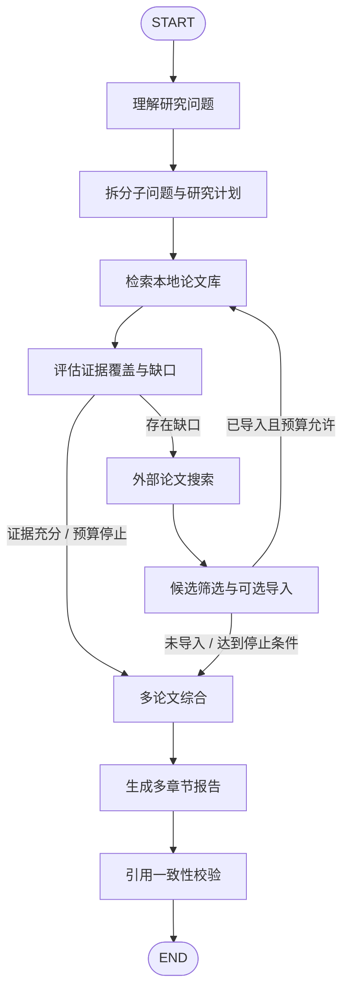

# LangGraph 深度研究工作流

```mermaid
flowchart TD
    START(["START"]) --> U["理解研究问题"]
    U --> P["拆分子问题与研究计划"]
    P --> L["检索本地论文库"]
    L --> A["评估证据覆盖与缺口"]
    A -->|"证据充分 / 预算停止"| S["多论文综合"]
    A -->|"存在缺口"| E["外部论文搜索"]
    E --> C["候选筛选与可选导入"]
    C -->|"已导入且预算允许"| L
    C -->|"未导入 / 达到停止条件"| S
    S --> R["生成多章节报告"]
    R --> V["引用一致性校验"]
    V --> END(["END"])
```

显式停止条件：最大迭代数、最大外部搜索次数、最大论文数、最大证据数、最大估算
Token，以及连续多轮没有新增证据。
