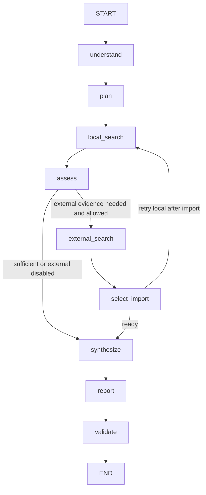

# LangGraph Deep Research Workflow

This document describes the fixed Deep Research Workflow path. It is the
Workflow/control-group runtime, not the Research Agent.

## Graph



The implementation is `src/paper_research/agents/deep_research_graph.py`.

## Control-flow boundary

The Workflow follows a predefined graph with conditional routing around external
search/import. It does not select arbitrary tools from an Agent policy after
each observation. That behavior belongs to the separate Research Agent runtime.

The repository UI currently sends the Workflow request to:

```text
POST /api/v1/research/deep
```

with `allow_external_search=false` from the UI path. API callers can set
`allow_external_search=true`, subject to provider/configuration availability.

## Checkpointing

The graph accepts a LangGraph checkpointer. In-memory checkpointing is available
for tests; PostgreSQL checkpointing is used where configured and verified by the
runtime capability checks.

## Benchmark boundary

Stage 4 uses this Workflow as the frozen control group. The later Research Agent
final-report synthesis layer is not part of this Workflow and must not be
counted as a Workflow improvement.
