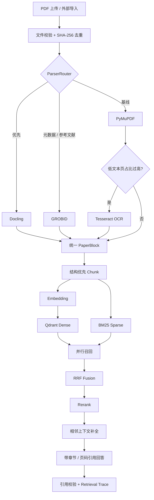

# PDF 解析与 RAG 数据流

```mermaid
flowchart TD
    A["PDF 上传 / 外部导入"] --> B["文件校验 + SHA-256 去重"]
    B --> C{"ParserRouter"}
    C -->|"优先"| D["Docling"]
    C -->|"元数据 / 参考文献"| E["GROBID"]
    C -->|"基线"| F["PyMuPDF"]
    F --> G{"低文本页占比过高?"}
    G -->|"是"| H["Tesseract OCR"]
    G -->|"否"| I["统一 PaperBlock"]
    D --> I
    E --> I
    H --> I
    I --> J["结构优先 Chunk"]
    J --> K["Embedding"]
    K --> L["Qdrant Dense"]
    J --> M["BM25 Sparse"]
    L --> N["并行召回"]
    M --> N
    N --> O["RRF Fusion"]
    O --> P["Rerank"]
    P --> Q["相邻上下文补全"]
    Q --> R["带章节 / 页码引用回答"]
    R --> S["引用校验 + Retrieval Trace"]
```
