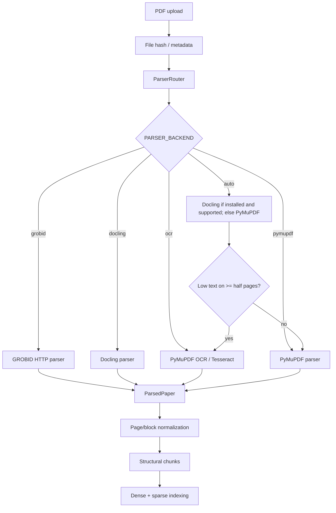

# PDF RAG Data Flow

This document describes the current PDF-to-RAG path and distinguishes available
capabilities from the frozen portfolio benchmark configuration.

## Ingestion and parsing



## Parser capabilities

| Backend | Status in code | Runtime requirement |
| --- | --- | --- |
| PyMuPDF | Baseline parser | Python dependency `pymupdf`. |
| OCR | Available route | Tesseract must be installed and discoverable. |
| Docling | Optional parser | `docling` optional dependency must be installed. |
| GROBID | Optional HTTP parser | `GROBID_URL` must be configured and reachable. |

Capabilities endpoints report optional parser degradation rather than pretending
that an unavailable optional backend is ready.

## Frozen RAG backend

Stage 3 and Stage 4 use
`data/evaluation/research-agent/stage3-rag-backend-lock-v1.json`:

```text
retrieval = Current Hybrid
reranker = disabled
query_rewrite = disabled
query_decomposition = disabled
context_selector = baseline
stage2_final_config_hash = 995a144385180b2931ec2c6366f7f7306301a42d77ad7c85f4be9e6d9e5091d9
```

The Research Agent may decide when to retrieve and what query to issue for a
subquestion, but it must not enable a new retriever, new embedding model,
reranker, query rewrite module, or query decomposition module.

## Retrieval and context

The current frozen path is:

```text
structural chunks
-> Jina dense vectors
-> Qdrant production collection
-> lexical sparse index
-> Hybrid RRF
-> baseline context builder
```

Reranking, query rewriting, query decomposition, and context selector variants
remain documented as evaluated experiments. They are not part of the frozen
Stage 4 backend.
