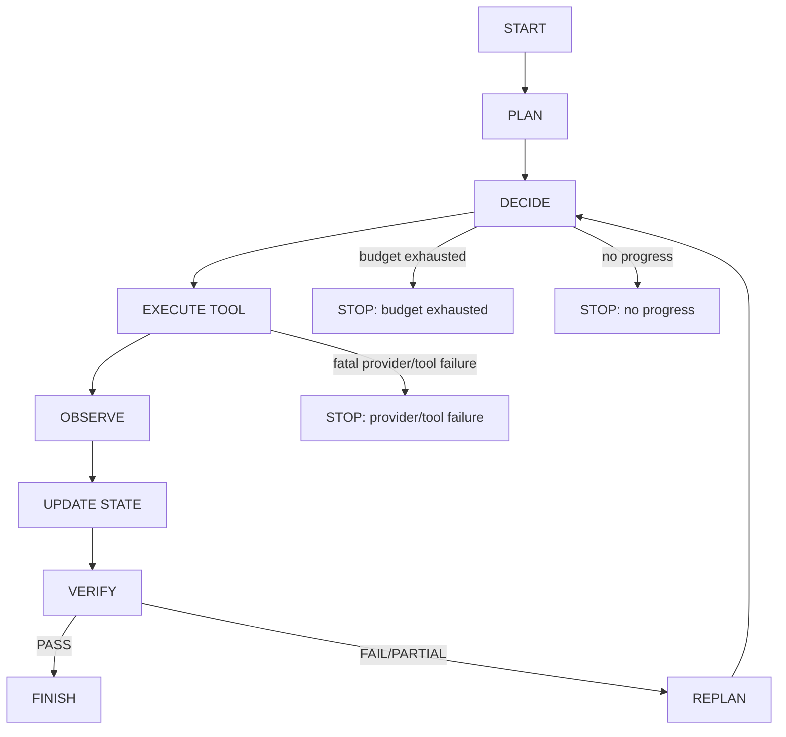

# Research Agent Architecture v1

LangGraph remains the existing workflow substrate for the control-group Deep
Research path. Research Agent v1 is introduced as a parallel runtime path whose
next actions are selected dynamically from current state and observations rather
than following a fixed research sequence.

The existing `CONTROL_GROUP_WORKFLOW` is not rewritten and remains the default.
Agent mode is exposed separately as `research_mode=agent`.
