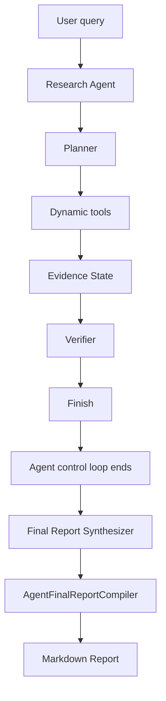

# Research Agent Final Report Synthesis v1

`AGENT_FINAL_REPORT_SYNTHESIS=true`

This is a post-Agent presentation/synthesis stage. It is not an Agent decision-loop extension, Agent v2, a new tool, a new planner, or a RAG change.

## Architecture



The Agent decides how to research. The final-report synthesizer decides how to present already verified research results to the user.

## Stage 4 boundary

Stage 4 benchmark artifacts and conclusions correspond to the frozen v1.1.0 Agent runtime before final-report synthesis was added.

This feature does not rerun Stage 4, reinterpret Stage 4, or change the frozen Workflow-vs-Agent benchmark conclusions.

## Final report input fields

The report synthesizer may use only:

- original research query;
- verified evidence blocks;
- paper metadata;
- evidence IDs;
- page numbers;
- verification status;
- research gaps;
- tool observations;
- paper IDs.

It must not receive or persist:

- hidden chain-of-thought;
- raw provider reasoning;
- system prompt;
- private planner reasoning.

## Evidence policy

Final report synthesis is `Evidence -> Writing`.

It does not call retrieval, reranking, query rewrite, query decomposition, or context selection. `new_retrieval_requests=0`.

The provider-facing draft uses one global verified evidence namespace:

```text
E01
E02
E03
...
```

Every factual claim in the draft must cite one or more IDs from the frozen verified Evidence State.

## Provider-facing draft

The provider returns a simple draft:

```json
{
  "title": "...",
  "summary": "...",
  "sections": [
    {
      "title": "...",
      "claims": [
        {
          "text": "...",
          "evidence_ids": ["E01"]
        }
      ]
    }
  ],
  "research_gaps": ["..."]
}
```

Model-authored control/status fields are forbidden:

- `verification_pass`
- `report_valid`
- `citation_valid`
- `insufficient_evidence`
- `quality_gate_pass`
- `status`
- `completed`

These are system-derived state, not model content.

## Compiler and validation

`AgentFinalReportCompiler`:

- parses the draft;
- rejects model-authored control fields;
- validates that every claim citation ID exists in the verified Evidence State;
- rejects factual claims with no citation IDs;
- canonicalizes the report structure;
- derives report metadata;
- renders final Markdown.

The compiler does not:

- create claims;
- replace citations;
- delete unsupported claims;
- automatically attach a citation to a claim.

Unknown citation IDs produce `AGENT_REPORT_INVALID_CITATION`.

## Status separation

Agent execution status remains separate from report generation status.

Example:

```text
status=COMPLETED
verification_status=PASS
report_status=AVAILABLE
```

or:

```text
status=COMPLETED
verification_status=PASS
report_status=FAILED_PROVIDER
```

A report synthesis failure must not rewrite a completed Agent execution as failed.

## API fields

The Agent response adds backward-compatible fields:

- `report_status`
- `report_markdown`
- `report_available`
- `report_failure_reason`
- `report_usage`
- `report_provider_requests`
- `agent_execution_provider_requests`
- `agent_execution_tokens`
- `agent_report_tokens`
- `total_agent_user_request_tokens`
- `report_claim_count`
- `report_citation_count`
- `report_evidence_references`
- `final_report_input_fields`

Existing Agent execution fields remain unchanged.
