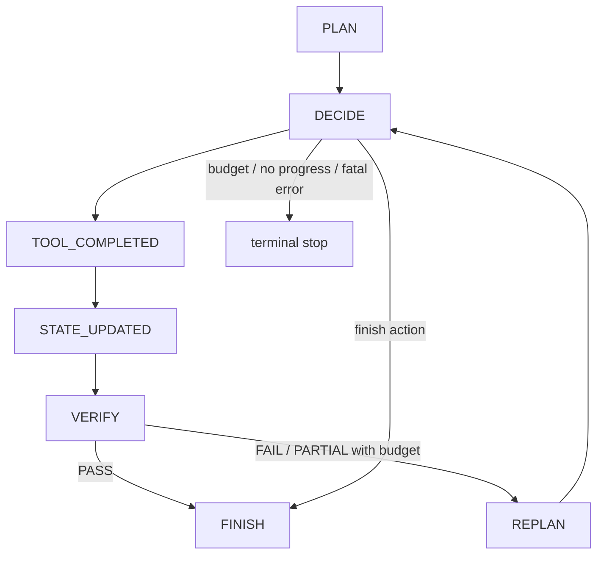

# Research Agent Runtime

This document describes the current Research Agent runtime after the v1.1.0
portfolio release and the later final-report synthesis hotfix.

## API surface

| Endpoint | Purpose |
| --- | --- |
| `POST /api/v1/research/agent` | Start an Agent task. |
| `GET /api/v1/research/agent/{task_id}` | Read saved Agent state/result. |
| `POST /api/v1/research/agent/{task_id}/resume` | Resume from the latest checkpoint. |

The UI exposes Agent as an explicit mode. Workflow remains preselected when no
mode parameter is supplied.

## Control loop



The Agent stores structured state, observations, Evidence State, budget,
checkpoint IDs, tool history, provider usage, and trace events. It does not store
hidden chain-of-thought.

## Frozen RAG backend

The Agent validates
`data/evaluation/research-agent/stage3-rag-backend-lock-v1.json` before startup.
The locked backend is:

```text
Current Hybrid retrieval
reranker disabled
query rewrite disabled
query decomposition disabled
baseline context selector
```

The Agent may split the research task into subquestions and decide when to
retrieve. It must not enable new retrieval modules that are not in the frozen
backend.

## Final-report synthesis layer

The current runtime can synthesize a user-facing Agent report after the Agent
control loop completes and verification passes. This layer:

- consumes verified Evidence State only;
- rejects model-authored control fields;
- validates citations against observed evidence IDs;
- records report provider usage separately from Agent execution usage.

It is not an Agent tool, planner step, retriever, or replan behavior. It was
added after the frozen Stage 4 benchmark runtime and does not change the Stage 4
benchmark interpretation.

## Stage 4 evidence boundary

Stage 4 showed dynamic tool/action selection and structured completion
reliability. It did not observe effective live replan:

```text
LIVE_EFFECTIVE_REPLAN_NOT_OBSERVED
effective_replan_count = 0
```

Therefore public claims should say the runtime supports bounded replan, but the
final benchmark did not naturally exercise effective replan.
